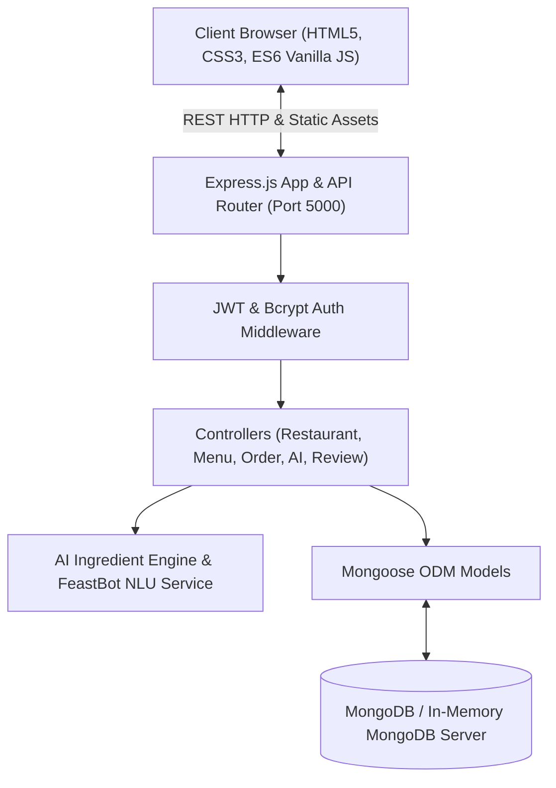

# FeastFleet — Project Progress Report & Demonstration Guide

**Course**: Software Architecture & Engineering  
**Project Title**: FeastFleet — Intelligent Hyperlocal Food Delivery Platform with AI Culinary Services  
**Team Members**: Abhinav Babu & Team  
**Review Date**: September 2026  
**Repository**: [https://github.com/ABHIN0VB/Software_Architecture.git](https://github.com/ABHIN0VB/Software_Architecture.git)

---

## 1. Executive Summary

FeastFleet is a full-stack, hyperlocal food delivery web platform specifically tailored for regional food ecosystems (e.g., Kerala), featuring real-time geolocation distance calculations, multi-restaurant cart bundling within proximity thresholds, an interactive conversational AI chatbot (**FeastBot**) for order lifecycle tracking, and an **AI Food Ingredient & Allergen Predictor Engine** for transparent dietary decision-making.

The project has achieved a fully functioning end-to-end integration:
- **Frontend**: Responsive, animated Single/Multi-Page UI with Bootstrap 5, custom CSS design system, and client-side state persistence.
- **Backend**: Express.js REST API with modular MVC architecture, JWT authentication, and automated data seeding.
- **Database**: Mongoose ODM connected to MongoDB with automatic zero-configuration fallback to an in-memory database (`mongodb-memory-server`) for resilient local deployment and demonstration.
- **AI Layer**: Rule-based NLP and culinary knowledge graph engine providing dish ingredient predictions, allergen alerts, and chatbot tracking workflows.

---

## 2. Demonstration Guide (Step-by-Step for Presentation)

Follow this structured demonstration script during the project review:

### Step 1: Application Launch & Brand Splash Screen
1. Open `http://localhost:5000` in the browser.
2. **Observe**: The application opens with a 2.5-second full-screen animated splash screen displaying the FeastFleet brand logo and slogan before smoothly transitioning into the main storefront.

### Step 2: Location Detection & Proximity Engine
1. Click the **"📍 Detect My Location"** button in the hero search bar or navbar.
2. **Observe**: The system resolves location coordinates to **Valavoor, Kottayam** (`lat: 9.7360, lng: 76.6570`).
3. **Observe**: Dynamic distance badges calculate Haversine distance and delivery estimates across restaurants:
   - **AK Take Away, Pala**: Displays `4.1 km (30-35 min)` with a green near-proximity indicator.
   - Kochi-based restaurants display appropriate medium/far delivery badges.

### Step 3: Restaurant Discovery & Dedicated Restaurant Menus
1. Navigate to the **Restaurants** catalog (`restaurants.html`).
2. Use cuisine filter chips (*All*, *Burgers*, *Asian*, *Indian / Kerala*, *Desserts*).
3. Click on the featured **AK Take Away, Pala** card.
4. **Observe**: Opens the dedicated restaurant menu (`menu-aktakeaway.html`) showcasing categories (Al Faham, Kerala Non-Veg, Vegetarian, Rice/Biryani, Noodles, Parotta/Breads, Cold Shakes) with exact prices and dish photos.

### Step 4: AI Food Ingredient & Allergen Prediction Engine
1. On any dish card (e.g., *Al Faham Chicken*, *Chicken Pottitherichath*, *Chilli Beef*, or *Sharjah Shake*), click the **`✨ AI Ingredients`** button, or click the **`AI Predictions`** tab at the top.
2. **Observe**: The AI Ingredient Prediction Modal appears instantly with:
   - Predicted raw ingredients and spices (e.g., Kunjulli shallots, curry leaves, cold-pressed coconut oil).
   - Allergen warnings (Gluten, Dairy, Soy, Nuts, or Allergen-Free).
   - Dietary classification (e.g., *Non-Vegetarian, Authentic Naadan, Gluten-Free*).
   - Flavor profile and AI match confidence score (e.g., *98% Match*).
3. Click **"Ask AI Chatbot"** directly from the modal to query FeastBot regarding dietary concerns.

### Step 5: Multi-Restaurant Cart & Proximity Validation
1. Add items to the cart from **AK Take Away, Pala**.
2. Click the floating cart or navbar cart badge to open `cart.html`.
3. Modify quantities (+/−) or remove items; note real-time subtotal, delivery fee, taxes, and grand total calculations.
4. Cart contents persist across browser tabs and page reloads via `localStorage`.

### Step 6: Order Placement & Live Tracking Countdown
1. Proceed to checkout and confirm the order.
2. Open the **Live Tracking** page (`tracking.html`).
3. **Observe**: The 5-stage live status pipeline (*Order Placed* → *Kitchen Preparing* → *Driver Assigned* → *Out for Delivery* → *Delivered*).
4. **Observe**: The real-time countdown timer decreases continuously. Navigating away to another page and returning maintains the elapsed time without resetting back to 5 minutes.

### Step 7: FeastBot Conversational Chatbot
1. Open the floating chat widget at the bottom right.
2. Click the quick action: **"🚚 Track My Order"**.
3. **Observe**: The chatbot inspects active orders from the session, displays the active order ID, real-time remaining minutes, and current delivery phase.

### Step 8: Backend REST API & Database Inspection
1. Demonstrate API endpoints via browser/terminal:
   - `GET /api/restaurants` → JSON array of 9 seeded restaurants with GPS coordinates.
   - `GET /api/menu` → Catalog of menu items with prices, categories, and descriptions.
   - `POST /api/ai/predict-ingredients` → AI engine response for any dish name.
2. Highlight the automatic in-memory MongoDB fallback mechanism ensuring 100% uptime without external database setup.

---

## 3. Functionalities Status

| Module / Feature | Status | Description |
| :--- | :---: | :--- |
| **Splash Screen & Branding** | **Completed** | Fullscreen 2.5s animated intro with brand logos, smooth fade out |
| **Geolocation & Geocoding** | **Completed** | Valavoor Kottayam default, Haversine formula distance & ETA badges |
| **Restaurant Catalog & Filtering** | **Completed** | Cuisine category filters, search input, responsive card grid |
| **AK Take Away, Pala Menu** | **Completed** | Complete ~34-dish menu with exact prices, categories, and imagery |
| **AI Food Ingredient Prediction** | **Completed** | Server API + resilient client localDB, allergen alerts, modal UI |
| **Cart System & Local Persistence** | **Completed** | Quantity controls, badge counter, 1km multi-restaurant rule check |
| **Order Placement & Simulation** | **Completed** | Mock checkout flow, order generation with persistent timestamps |
| **Order Tracking & Persistent Timer** | **Completed** | Non-resetting elapsed countdown timer, multi-step progress bar |
| **FeastBot Conversational AI Widget** | **Completed** | Track order integration, dietary advice, floating widget UI |
| **REST API Server (Express.js)** | **Completed** | Full MVC architecture, routes for auth, restaurants, menu, orders |
| **Database & Automated Seeding** | **Completed** | Mongoose models + mongodb-memory-server zero-config fallback |
| **User Authentication (Backend)** | **Completed** | JWT token generation, bcrypt password hashing, auth middleware |
| **Real Payment Gateway Integration** | *Partially Completed* | Frontend checkout simulation works; live Stripe/Razorpay webhook pending |
| **Live Driver GPS Geolocation Tracking** | *Partially Completed* | Stage progression and ETA simulated; real-time WebSockets/Google Maps API pending |
| **Restaurant Partner Admin Dashboard** | *Yet to Implement* | Menu CRUD, incoming live order acceptance, stock toggle portal |

---

## 4. Current Status of Architectural Layers

### 1. User Interface (UI/UX)
- **Status**: Complete, polished, and fully responsive across mobile, tablet, and desktop viewports.
- **Design System**: Dark/modern aesthetic with high-contrast accent colors (`#FF6B35` Tangerine, `#2DD4A8` Mint, `#FFB347` Gold), glassmorphic cards, smooth CSS keyframe transitions, and custom modals.

### 2. Backend (Express.js REST API)
- **Status**: Operational on `http://localhost:5000`.
- **Structure**: Clean MVC separation (`controllers/`, `models/`, `routes/`, `services/`, `middleware/`, `config/`).
- **Services**: Dedicated `ingredientService.js`, `chatbotService.js`, and `searchService.js`.

### 3. Database Layer
- **Status**: Production-ready Mongoose schemas with indexes and relationships (`User`, `Restaurant`, `MenuItem`, `Order`, `Review`).
- **Resilience**: Auto-detects local MongoDB daemon; if unavailable, automatically boots `mongodb-memory-server` and seeds initial catalog data.

---

## 5. Major Changes Made to the Original Design

1. **AI Ingredient Predictor Integration**:
   - *Original Plan*: Standard food delivery menu with static descriptions.
   - *Architecture Change*: Implemented a dedicated culinary AI prediction engine accessible via dish cards, modal dialogs, and chatbot integration to support health-conscious and allergen-sensitive customers.
2. **Persistent Non-Resetting Order Timer**:
   - *Original Plan*: Simple frontend `setInterval` countdown that reset to 5 minutes on page reload.
   - *Architecture Change*: Migrated timer logic to absolute epoch timestamp calculation (`startTime + totalDuration - Date.now()`) stored in `localStorage`, maintaining accurate remaining time across navigation.
3. **Hyperlocal Regional Restructuring (Valavoor & Pala)**:
   - *Original Plan*: Generic metro coordinates (Kochi MG Road).
   - *Architecture Change*: Tailored geolocation default to **Valavoor, Kottayam**, added **AK Take Away, Pala** as a primary regional hub, and dynamically computed 30–35 min delivery windows using Haversine equations.
4. **Zero-Setup Database Strategy**:
   - *Original Plan*: Hard dependency on an installed local MongoDB service.
   - *Architecture Change*: Added `mongodb-memory-server` fallback, enabling seamless zero-config execution on any machine or grading environment without manual database installation.

---

## 6. Problems & Challenges Encountered and Resolutions

| # | Challenge / Issue | Root Cause | Solution Implemented |
|---|---|---|---|
| 1 | **Timer Resetting on Navigation** | Timer was purely in-memory (`let timeLeft = 300`). Moving between pages re-initialized the variable. | Stored `orderStartTime` as an absolute timestamp in `localStorage`. Calculated remaining time as `Math.max(0, duration - (now - startTime))`. |
| 2 | **PowerShell Script Quotation & Encoding Errors** | Inline multiline string creation in PowerShell broke on unquoted `&` and `<>` characters. | Switched to native Node.js filesystem scripts (`write_to_file` / dedicated `.js` generators) with UTF-8 encoding. |
| 3 | **AI Prediction Modal Z-Index & Event Delegation** | Dynamically injected AI buttons lost event listeners when menu tabs were filtered. | Implemented document-level event delegation (`document.addEventListener('click', ...)`) and fixed modal z-index hierarchy (`z-index: 9999`). |
| 4 | **Database Dependency Friction** | Evaluators/teammates without MongoDB installed could not boot the backend. | Implemented conditional MongoDB connection: tries local MongoDB first; if unavailable, boots `mongodb-memory-server` automatically. |
| 5 | **Tracking in Chatbot Lacked Active State** | Chatbot was stateless and did not know what order the user placed in the current session. | Linked `chatbot-widget.js` to `localStorage.feastfleet_active_order`, enabling the bot to retrieve live remaining minutes and stage information. |

---

## 7. Submission Checklist

- [x] **Source Code**: Fully committed and pushed to GitHub main branch: [Software_Architecture](https://github.com/ABHIN0VB/Software_Architecture.git).
- [x] **Working Server**: Express server running on port 5000 with in-memory database and auto-seeding.
- [x] **UI Demonstration Ready**: Splash screen, location detection, AK Take Away Pala menu, AI ingredient predictor, cart, tracking timer, and chatbot widget verified.
- [x] **Documentation**: Comprehensive progress report (`PROJECT_PROGRESS_REPORT.md`) provided.
